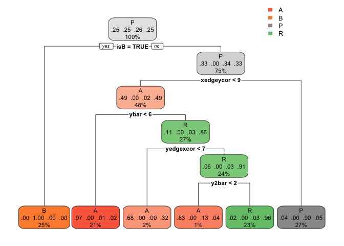

    library(ggplot2)
    library(caTools)
    library(plotROC)
    library(ROCR)
    library(rpart) # CART
    library(rpart.plot) # CART plotting
    library(caret) # c
    library(randomForest)
    library(gbm)
    library(GGally)
    library(MASS)

1.1 Simple Intro on is “B”
--------------------------

To make the problem easier, as well as getting to know the big picture
of the data, we’ll start by predicting whether or Not the letter is “B”

    ## load the data
    Letters = read.csv("Letters.csv",sep = ",")

#### add an “isB” column on the dataset

    Letters$isB = as.factor((Letters$letter == "B"))

#### Train Test Split

Put 65% of the data in the training set and 35% in the test set

    train.ids = sample(nrow(Letters), 0.65* nrow(Letters))
    Letters.train = Letters[train.ids, ]
    Letters.test = Letters[-train.ids, ]

#### 1 i) Baseline Model

This model always predicts “not B”, we’ll derive its performance in test
set

    table(Letters.train$isB)

    ## 
    ## FALSE  TRUE 
    ##  1521   504

    Accuracy = sum(Letters.train$isB == FALSE) / nrow(Letters.train)
    table(Letters.test$isB)

    ## 
    ## FALSE  TRUE 
    ##   829   262

    Base_Accuracy = sum(Letters.test$isB == FALSE) / nrow(Letters.test)

    paste("The Accuracy of the baseline model:", Base_Accuracy) 

    ## [1] "The Accuracy of the baseline model: 0.759853345554537"

#### 1 ii) Logistic Regression

A typical logistic regression that include all the variables, threshold
is set at $ p = 0.5$

    ## remove the letter for training
    log_model = glm(data = subset(Letters.train, select=c(-letter) ), family = "binomial", isB ~.)
    summary(log_model)

    ## 
    ## Call:
    ## glm(formula = isB ~ ., family = "binomial", data = subset(Letters.train, 
    ##     select = c(-letter)))
    ## 
    ## Deviance Residuals: 
    ##     Min       1Q   Median       3Q      Max  
    ## -3.2286  -0.1550  -0.0211   0.0000   3.1676  
    ## 
    ## Coefficients:
    ##              Estimate Std. Error z value Pr(>|z|)    
    ## (Intercept) -14.87595    2.45944  -6.049 1.46e-09 ***
    ## xbox          0.06181    0.12372   0.500  0.61738    
    ## ybox         -0.03750    0.08644  -0.434  0.66441    
    ## width        -1.19031    0.15257  -7.802 6.10e-15 ***
    ## height       -0.54764    0.13472  -4.065 4.80e-05 ***
    ## onpix         0.84470    0.13028   6.484 8.95e-11 ***
    ## xbar          0.54079    0.12267   4.409 1.04e-05 ***
    ## ybar         -0.61034    0.11570  -5.275 1.33e-07 ***
    ## x2bar        -0.47232    0.09675  -4.882 1.05e-06 ***
    ## y2bar         1.24073    0.12026  10.317  < 2e-16 ***
    ## xybar         0.23440    0.08812   2.660  0.00781 ** 
    ## x2ybar        0.54196    0.12019   4.509 6.51e-06 ***
    ## xy2bar       -0.43889    0.10923  -4.018 5.87e-05 ***
    ## xedge        -0.25952    0.09026  -2.875  0.00404 ** 
    ## xedgeycor     0.14422    0.10008   1.441  0.14957    
    ## yedge         1.83068    0.13500  13.560  < 2e-16 ***
    ## yedgexcor     0.43038    0.07194   5.983 2.20e-09 ***
    ## ---
    ## Signif. codes:  0 '***' 0.001 '**' 0.01 '*' 0.05 '.' 0.1 ' ' 1
    ## 
    ## (Dispersion parameter for binomial family taken to be 1)
    ## 
    ##     Null deviance: 2272.50  on 2024  degrees of freedom
    ## Residual deviance:  639.53  on 2008  degrees of freedom
    ## AIC: 673.53
    ## 
    ## Number of Fisher Scoring iterations: 8

    ## predict on the test set
    pisB <- predict(log_model, newdata = subset(Letters.test, select=c(-letter) ), type = "response")
    pisB = pisB > 0.5

    ## construct the confusion matrix
    confusion_m <- table(Letters.test$isB, pisB)
    confusion_m

    ##        pisB
    ##         FALSE TRUE
    ##   FALSE   797   32
    ##   TRUE     29  233

    log_accuracy = (confusion_m[1] + confusion_m[4])/sum(confusion_m)
    paste("The Accuracy of the logistic regression model:", log_accuracy)

    ## [1] "The Accuracy of the logistic regression model: 0.944087992667278"

We also calculate the AUC of the model

    predTestLog <- predict(log_model, newdata = subset(Letters.test, select=c(-letter) ), type = "response")
    rocr.log.pred <- prediction(predTestLog, Letters.test$isB)
    logPerformance <- performance(rocr.log.pred, "tpr", "fpr")
    plot(logPerformance, colorize = TRUE)
    abline(0, 1)

    # AUC
    paste("As calulated, AUC = ",as.numeric(performance(rocr.log.pred, "auc")@y.values))

    ## [1] "As calulated, AUC =  0.977186714426466"

#### 1 iii) CART Model to predict “isB”

Cross Validation is applied to select the cp(complexity parameter) of
the model.

    ## A list of cp value will be test 
    cpVals = data.frame(cp = seq(0, .1, by=.001)) 

    train.cart <- train(isB ~ .,
                        data = subset(Letters.train, select=c(-letter) ),
                        method = "rpart",
                        tuneGrid = cpVals,
                        trControl = trainControl(method = "cv", number=10),
                        metric = "Accuracy")

    Letters.test.mm = as.data.frame(model.matrix(isB~.+0, data=Letters.test))

    ## a threshold of 0.5 is set for decision
    pred.cart <- predict(train.cart,newdata = Letters.test.mm, type="prob" )
    pred_cart = pred.cart[,2] > 0.5

    confusion_m <- table(Letters.test$isB, pred_cart)
    confusion_m

    ##        pred_cart
    ##         FALSE TRUE
    ##   FALSE   789   40
    ##   TRUE     43  219

    cart_accuracy = (confusion_m[1] + confusion_m[4])/sum(confusion_m)
    paste("The Accuracy of the CART model:", cart_accuracy)

    ## [1] "The Accuracy of the CART model: 0.923923006416132"

    # A cp vs Accuracy to help us on deciding cp
    ggplot(train.cart$results, aes(x=cp, y=Accuracy)) + geom_point(size=3) +
      xlab("Complexity Parameter (cp)") + geom_line()

#### 1 iv) Random Forest to predict “isB”

    ## train the RF model
    mod.rf <- randomForest(isB ~ .,
                        data = subset(Letters.train, select=c(-letter)))

    pred.rf <- predict(mod.rf, newdata = Letters.test, type = "response") 

    confusion_m <- table(Letters.test$isB, pred.rf)
    confusion_m

    ##        pred.rf
    ##         FALSE TRUE
    ##   FALSE   823    6
    ##   TRUE     13  249

    rf_accuracy = (confusion_m[1] + confusion_m[4])/sum(confusion_m)
    paste("The Accuracy of the Random Forest :", rf_accuracy)

    ## [1] "The Accuracy of the Random Forest : 0.982584784601283"

#### 1 v) Summary

    data.frame(Model = c("Baseline","Logistic Regression","CART","Random Forest"), Accuracy = c(Base_Accuracy, log_accuracy, cart_accuracy, rf_accuracy))

    ##                 Model  Accuracy
    ## 1            Baseline 0.7598533
    ## 2 Logistic Regression 0.9440880
    ## 3                CART 0.9239230
    ## 4       Random Forest 0.9825848

2. Prediction on “A”, “B”, “P”, “R”
-----------------------------------

Now, let’s move on to a more general case: predicting a letter is one of
“A”, “B”, “P”, “R”. It can be extended to the full 26 letters case, but
this will inflate the model complexity and run time. For the sake of
simplicity, we’ll run the demo of four letter case here.

#### 2 i) Baseline Model

    table(Letters.train$letter)

    ## 
    ##   A   B   P   R 
    ## 499 504 522 500

    table(Letters.test$letter)

    ## 
    ##   A   B   P   R 
    ## 290 262 281 258

    ## Since "A" appears most frequently in the training set, we'll always predict the "A" in the test set
    Base_Accuracy = sum(Letters.test$letter == "A") / nrow(Letters.test)
    paste("Baseline Model Accuracy = " ,Base_Accuracy) 

    ## [1] "Baseline Model Accuracy =  0.265811182401467"

#### 2 ii) LDA (Latent Dirichlet allocation)

    LdaModel <- lda(letter ~ ., data=subset(Letters.train, select = c(-isB)))

    predTestLDA <- predict(LdaModel, newdata = Letters.test)

    confusion_m <- table(predTestLDA$class, Letters.test$letter)
    confusion_m

    ##    
    ##       A   B   P   R
    ##   A 275   0   0   0
    ##   B   0 235  15  27
    ##   P   1   0 261   0
    ##   R  14  27   5 231

    lda_accuracy = sum(predTestLDA$class == Letters.test$letter)/nrow(Letters.test)
    paste("LDA Accuracy:" ,lda_accuracy)

    ## [1] "LDA Accuracy: 0.918423464711274"

#### 2 iii) CART

    cpVals = data.frame(cp = seq(0, .001, by=.1))

    train.cart_2 <- train(letter ~ .,
                        data = subset(Letters.train, select=c(-isB) ),
                        method = "rpart",
                        tuneGrid = cpVals,
                        trControl = trainControl(method = "cv", number=5),
                        metric = "Accuracy")

    train.cart_2

    ## CART 
    ## 
    ## 2025 samples
    ##   16 predictor
    ##    4 classes: 'A', 'B', 'P', 'R' 
    ## 
    ## No pre-processing
    ## Resampling: Cross-Validated (5 fold) 
    ## Summary of sample sizes: 1619, 1619, 1621, 1620, 1621 
    ## Resampling results:
    ## 
    ##   Accuracy   Kappa    
    ##   0.8874337  0.8499134
    ## 
    ## Tuning parameter 'cp' was held constant at a value of 0

    Letters.test.mm = as.data.frame(model.matrix(letter~.+0, data=Letters.test))

    pred.cart <- predict(train.cart_2, newdata = Letters.test.mm, type="prob" )
    pred.cart$results = colnames(pred.cart)[apply(pred.cart,1,which.max)]

    confusion_m <- table(Letters.test$letter, pred.cart$results)
    confusion_m

    ##    
    ##       A   B   P   R
    ##   A 278   2   4   6
    ##   B   4 222  10  26
    ##   P   3   8 259  11
    ##   R   4  30   1 223

    cart_accuracy_2 = sum(Letters.test$letter == pred.cart$results)/(nrow(Letters.test))
    paste("CART Accuracy" ,cart_accuracy_2)

    ## [1] "CART Accuracy 0.900091659028414"

    tree <- rpart(letter ~., data = Letters.train, method = "class")
    rpart.plot(tree)

#### 2 iv) Bagging of CART models

    ## fit the model
    train.letter.mm = as.data.frame(model.matrix(letter ~ . + 0, data = subset(Letters.train, select=c(-isB))))

    mod.bag <- randomForest(x = train.letter.mm, y = Letters.train$letter, mtry = 16)
    mod.bag

    ## 
    ## Call:
    ##  randomForest(x = train.letter.mm, y = Letters.train$letter, mtry = 16) 
    ##                Type of random forest: classification
    ##                      Number of trees: 500
    ## No. of variables tried at each split: 16
    ## 
    ##         OOB estimate of  error rate: 4.79%
    ## Confusion matrix:
    ##     A   B   P   R class.error
    ## A 490   2   2   5  0.01803607
    ## B   4 471   3  26  0.06547619
    ## P   4  10 505   3  0.03256705
    ## R   6  31   1 462  0.07600000

    ## display the result 
    Letters.test.mm = as.data.frame(model.matrix(letter~.+0, data=Letters.test))

    pred.bag <- predict(mod.bag, newdata = Letters.test.mm)

    confusion_m <- table(pred.bag, Letters.test$letter)
    confusion_m 

    ##         
    ## pred.bag   A   B   P   R
    ##        A 289   2   1   0
    ##        B   0 249   2   9
    ##        P   0   1 276   1
    ##        R   1  10   2 248

    bagging_accuract = sum(pred.bag == Letters.test$letter)/nrow(Letters.test)
    paste("Bagging of CART Accuracy: ", bagging_accuract)

    ## [1] "Bagging of CART Accuracy:  0.973418881759853"

#### 2 v) Random Forest

We use 5-fold cross validation to find the best entry of mtry

    mod.rf <- randomForest(letter ~ ., data = subset(Letters.train, select=c(-isB) ), mtry = 5)
    mod.rf

    ## 
    ## Call:
    ##  randomForest(formula = letter ~ ., data = subset(Letters.train,      select = c(-isB)), mtry = 5) 
    ##                Type of random forest: classification
    ##                      Number of trees: 500
    ## No. of variables tried at each split: 5
    ## 
    ##         OOB estimate of  error rate: 2.77%
    ## Confusion matrix:
    ##     A   B   P   R class.error
    ## A 496   1   1   1 0.006012024
    ## B   0 485   1  18 0.037698413
    ## P   1   9 510   2 0.022988506
    ## R   1  21   0 478 0.044000000

    pred.rf <- predict(mod.rf, newdata = Letters.test) 
    table(pred.rf, Letters.test$letter)

    ##        
    ## pred.rf   A   B   P   R
    ##       A 290   1   0   0
    ##       B   0 254   1   5
    ##       P   0   1 278   1
    ##       R   0   6   2 252

    rf_acc = sum(pred.rf == Letters.test$letter)/nrow(Letters.test)
    rf_acc

    ## [1] 0.984418

#### 2 vi) Gradient Boosting

    ## fit the gradient boosting machine 
    mod.boost <- gbm(letter ~ .-isB + 0, 
                     data = Letters.train,
                     distribution = "multinomial",
                     n.trees = 3300,
                     interaction.depth = 10)

    ## Warning: Setting `distribution = "multinomial"` is ill-advised as it is
    ## currently broken. It exists only for backwards compatibility. Use at your own
    ## risk.

    mod.boost

    ## gbm(formula = letter ~ . - isB + 0, distribution = "multinomial", 
    ##     data = Letters.train, n.trees = 3300, interaction.depth = 10)
    ## A gradient boosted model with multinomial loss function.
    ## 3300 iterations were performed.
    ## There were 16 predictors of which 16 had non-zero influence.

    pred.boost <- predict(mod.boost, newdata = subset(Letters.test, select=c(-isB)), type = "response",n.trees = 3300) 
    pred.boost <- apply(pred.boost, 1, which.max)
    pred.boost <- factor(pred.boost,levels = c(1,2,3,4),labels = c("A","B","P","R"))

    confusion_m <- table(pred.boost,Letters.test$letter)
    confusion_m

    ##           
    ## pred.boost   A   B   P   R
    ##          A 289   0   1   0
    ##          B   1 255   2   7
    ##          P   0   0 275   1
    ##          R   0   7   3 250

    gbm_acc = sum(pred.boost == Letters.test$letter)/nrow(Letters.test)

    paste("Gradient Boosting Accuracy: ", gbm_acc)

    ## [1] "Gradient Boosting Accuracy:  0.979835013748854"

#### 2 vii) Summary on the methods we used for recognizing “A” “B” “P” "R

    data.frame(Model = c("Baseline","CART","CART Bagging","Random Forest","Gradient Boosting"), Accuracy = c(Base_Accuracy, cart_accuracy_2, bagging_accuract, rf_acc, gbm_acc))

    ##               Model  Accuracy
    ## 1          Baseline 0.2658112
    ## 2              CART 0.9000917
    ## 3      CART Bagging 0.9734189
    ## 4     Random Forest 0.9844180
    ## 5 Gradient Boosting 0.9798350

A short summary to all the methods above, the Gradient boosting is
giving the best performance comparing to others. Without other
assumptions, GBM will be the model selected for further analysis on
letter recognition. Random forest also have a good performance among
other models, and a good thing of it is the time cost on training is
much lower than boosting, whereas its test set accuracy is only 0.0027
lower.
